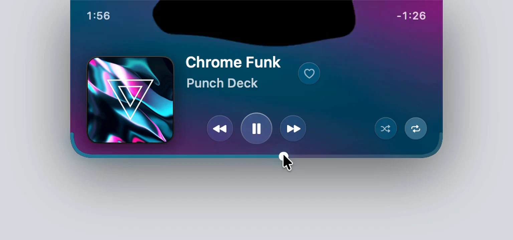

<h1></h1>

A free, open-source macOS music player that lives around the camera notch.
Retracted, it belongs entirely to the menu-bar band; expanded, it is a full
player whose black ferrofluid responds to real system audio and then settles
back into the notch. Works with Spotify and Apple Music.



**[magnetite.app](https://magnetite.app)** · MIT License · macOS 26 on Apple silicon

## Install

```bash
curl -fsSL https://magnetite.app/install.sh | sh
```

That downloads the latest [release](https://github.com/scryst/magnetite-releases/releases),
checks it against its published SHA-256, verifies the code signature, installs
it in `/Applications` (or `~/Applications` if that is not writable) and opens
it. Run it again to update. The script is [`install.sh`](install.sh) in this
repository; read it first if you like.

Other ways in:

- **Download the zip** from [Releases](https://github.com/scryst/magnetite-releases/releases),
  unzip it and drag Magnetite to Applications. Builds are not yet notarised by
  Apple, so the first launch is blocked once: approve it under System Settings ›
  Privacy & Security › Open Anyway. The script above avoids that step because
  `curl` does not quarantine what it downloads.
- **Build from source** with the Command Line Tools (`xcode-select --install`),
  no Xcode needed:

  ```bash
  git clone https://github.com/scryst/magnetite.git
  cd magnetite
  ./install.sh --from-source
  ```

Requirements: macOS 26 or later, Apple silicon. A MacBook with a camera notch is
the intended home; displays without one get a floating pill instead.

## Using it

- **Hover the notch** to open the player; move away and it retracts into the
  menu bar. Retracted, it still shows the cover and elapsed time either side of
  the camera.
- **Scrub** along the panel's bottom edge — the edge is the progress bar.
- **Two-finger swipe** over the notch: sideways skips a track, up or down plays
  or pauses.
- **The M in the menu bar** holds everything else: music source, volume and
  brightness HUDs, gestures, launch at login, and notch calibration if the
  drawn cutout does not match your hardware.
- The first time music plays, macOS asks to let Magnetite **control Spotify or
  Music** and to **record system audio** for the visualiser. Both can be changed
  later in System Settings › Privacy & Security. Audio is analysed on your Mac
  and never leaves it; there are no accounts, analytics or trackers.

**Liking tracks in Spotify (optional).** Spotify's local scripting interface
cannot read or change your library, so the heart needs the Web API. Choose
*Connect Spotify Library…* in the menu, create a free app at
[developer.spotify.com/dashboard](https://developer.spotify.com/dashboard) with
the redirect URI `http://127.0.0.1:8888/callback` and *Web API* ticked, and paste
its Client ID. It uses PKCE, so there is no secret; the refresh token is kept in
a `0600` file under `~/Library/Application Support/Magnetite`. Apple Music
favourites work without any of this.

**Uninstall.** Quit Magnetite from its menu and delete `Magnetite.app`. To remove
its settings too:

```bash
defaults delete com.laks.magnetite
rm -rf ~/Library/Application\ Support/Magnetite
```

## Develop

Built with SwiftPM against the Command Line Tools — no Xcode project.

```bash
./build.sh release      # -> build.noindex/Magnetite.app + versioned ZIP
./check.sh              # ten headless suites + site mutation harness
./deploy.sh             # publish site/ from the commit, never the working tree
open build.noindex/Magnetite.app
```

Issues and pull requests are welcome. Before opening a PR, run `./check.sh`;
it must pass. Read [`PRODUCT.md`](PRODUCT.md) before changing anything visual —
its anti-references are the acceptance checklist — and [`APP.md`](APP.md) for how
the app is built and why. Security reports go to the contact in
[`security.txt`](site/.well-known/security.txt).

Use `./deploy.sh` rather than pointing a host at `site/`. Serving the working
tree directly would include `site/test/` and any unfinished local files. The
script builds its payload from the committed tree with `git archive`, strips the
test harness, local server, and verification ZIP, runs the site gates in a
throwaway worktree, then verifies the exact committed page reached production.

`magnetite://toggle`, `magnetite://expand` and `magnetite://collapse` drive the UI from a
shell, which is the only sane way to verify a window that normally only appears
on hover.

Normal builds never touch the tracked release copy. After bumping the bundle
version, `./build.sh release --stage-release` stages new bytes in
`site/downloads/` and refuses to replace an existing version with a different
archive.

## What it does

- **Now playing** from Spotify or Apple Music over ScriptingBridge, with the
  panel's own bottom edge as the scrubber — no vertical space spent on a track.
- **A ferrofluid visualiser** driven by a real system-audio tap: a `CATapDescription`
  global mixdown inside a private aggregate device, FFT'd into twelve log-spaced
  bands. One continuous outline, displaced along its own normal.
- **Two-finger swipes** over the notch to skip and to play/pause, with a haptic.
- **Volume and brightness HUDs**, the brightness one filtered to manual changes
  so the ambient sensor cannot summon it.
- **Gets out of the way** on lock, screensaver and fullscreen, per display, with
  no preference to find.

[`PRODUCT.md`](PRODUCT.md) is the binding design contract — its anti-references
are the acceptance checklist. [`APP.md`](APP.md) documents how the thing is
built and, more usefully, why.

## Things that were only found by measuring

Each of these looked fine and was wrong:

- The visualiser's drive used absolute band levels. Music sits at 0.5–0.8
  permanently, so **16 of 17 peaks stood permanently** and the surface was a
  static wall. It measures per-band change against a 2.5s baseline now.
- The FFT windowed 512 real samples followed by 512 zeros — half a Hann window
  with a step in the middle, whose sidelobes leaked one bass note across all
  twelve bands. A ring buffer feeds it a full block.
- `isSettled` was computed from values rewritten 60×/s, and Observation fires on
  assignment rather than on change — so every `paused:` flag in the app was
  decorative. Fixing it took retracted CPU from ~17% to ~5%.
- The album-art palette could out-brighten its own white type, and a monochrome
  cover inherited the **previous** song's colour.

## Checks

`./check.sh` exists because the display slept partway through more than one
verification session. Eight app suites, two site suites, and the site's mutation
harness run with no display attached:

| Suite | Asserts |
|---|---|
| `fluidcheck` | the ferrofluid's physics and the audio pipeline's shape |
| `geometrycheck` | the panel and notch outline, at every margin |
| `gesturecheck` | what the swipe recogniser decides, and when |
| `mediacheck` | the media pipeline's rules, retries and state transitions |
| `librarycheck` | delayed Spotify library answers stay with their requesting player and track |
| `chromecheck` | the panel's chrome: layout, type, controls, marquee |
| `controllercheck` | window lifecycle, hover, pinning and visibility |
| `palettecheck` | album-art palette contrast against its own type |
| `portcheck` | the site renderer, layout, media, accessibility, read-only WebMCP, and release claims |
| `bandscheck` | the browser AudioWorklet analyser against dumps from the real Swift tap |
| `mutate` | each named site check rejects its deliberate regressions and accepts valid alternatives |

A check is not evidence until a deliberate mutation makes it fail *by name* —
several of these were written twice for that reason.

Use `./tools/check-runtime .build/checks/mediacheck` (or another compiled suite)
while iterating and `./check.sh` for the final candidate. The gate builds normally,
then runs every suite through the macOS sandbox. Home-directory file contents
outside the checkout and selected Node executable, preference and credential
services, Apple Events, and all network access are blocked. System/toolchain
reads remain available; this is not a restriction on reads from external volumes.
Repository inputs stay read-only; mutation copies and preference file
fallbacks use a private temporary directory. The child environment contains no
inherited provider tokens or interpreter options. Setup failure stops the gate.
Catchable cancellation stops the check's process group before temporary cleanup.
An uncatchable kill or host crash can leave private temporary files behind.

`./tools/check-runtime /usr/bin/python3 -I tools/runtimecheck.py` checks that
boundary with synthetic state; it also runs first in the full runtime gate.
Launching a binary directly bypasses this protection. The sandbox does not
replace deterministic test doubles or prove live player behavior. It requires
macOS `sandbox-exec`, Command Line Tools' Python 3, and Node.js; compatibility
must be checked when changing the supported macOS/toolchain versions.

The mutation harness prints its results after all runs finish; failed
expectations or stale targets fail the gate.

## Naming

The shipping product is **Magnetite** — the mineral actually suspended in real
ferrofluid, which is what the visualiser models. The SwiftPM module is still
`NotchApp` and the types are still `Notch*`: those name the surface the app
draws on, which has not changed, and churning them would rewrite every check
path for no user-visible gain. `build.sh` copies the built binary in as
`Magnetite` to match `CFBundleExecutable`, which is the name Activity Monitor
and the crash reporter show.

`Ferrofluid*` is not the product name and does not move with it: those types are
named for the physical phenomenon they simulate.

Two renames are behind this one, so two migrations run and neither may be
dropped. Preferences moved `com.laks.NotchApp` → `com.laks.ferro` →
`com.laks.magnetite`, and the Spotify refresh token moved with the Application
Support directory, `NotchApp` → `Ferro` → `Magnetite`. Both read the old names
newest-first, because someone can arrive from either. The URL scheme is the one
thing that does *not* keep its old spelling: a scheme is a global claim on the
machine, and two live registrations is how the wrong copy gets launched.

## License

[MIT](LICENSE). Two things in `site/` are not covered by it: Punch Deck's music
in `site/media/`, including the demo film's soundtrack (CC BY 4.0, credited on
the site), and the Gloock font in `site/fonts/` (SIL Open Font License, text
alongside it).
